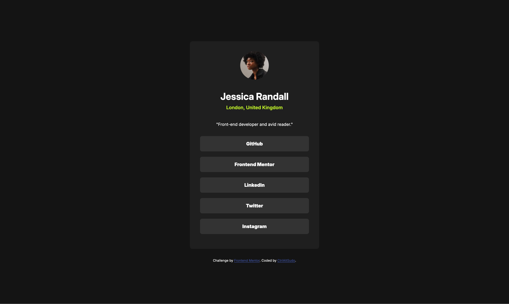

# Social-links-profile
<h1 align="center">Social Links Profile </h1>

 <a align="center" href="https://ctrlaltsudo.github.io/Social-links-profile/">Live Demo</a>

 <a align="center" href="https://www.frontendmentor.io/solutions/social-links-profile-vHPEBCDuHG">Solution Page</a>

<h2 align="center">Project Screenshot<h2>

  </img>

## Description

This is a Frontend Mentor challenge, click the link above to visit the challenge page. 

## Built with 

HTML

CSS

Flexbox

## What I learnt 

Just dusting off the cobwebs, I haven't touched front-end in awhile. 

## Authors

<a href="https://github.com/CtrlAltSudo">CtrlAltSudo</a>.
